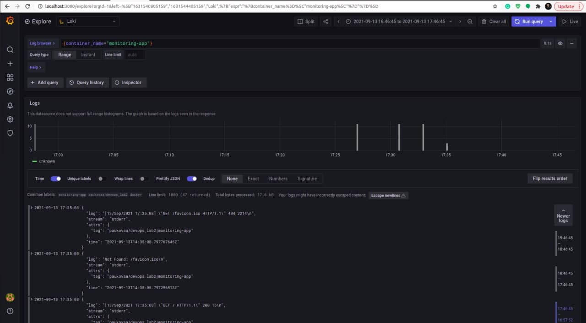
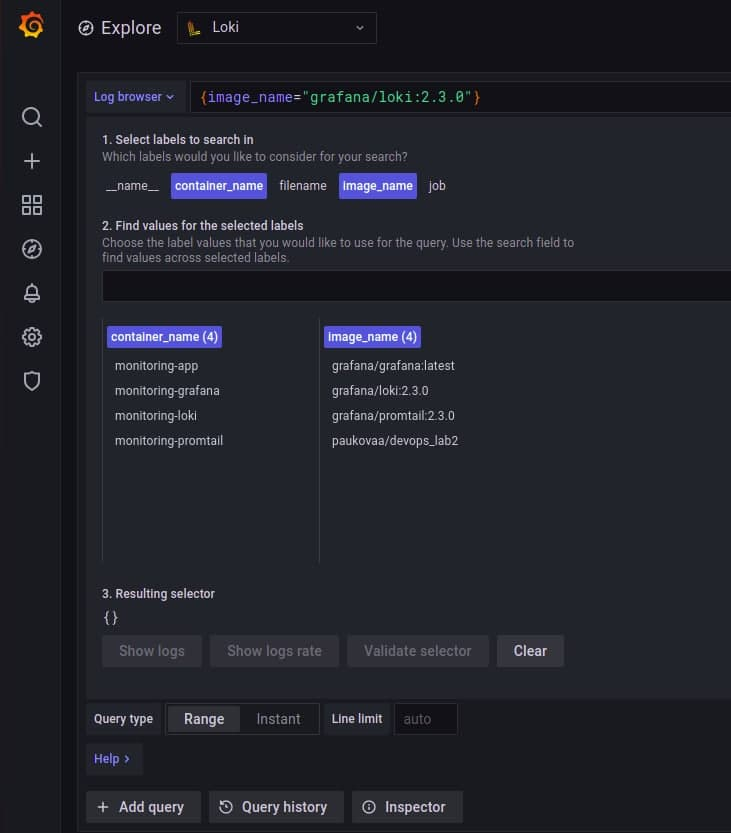
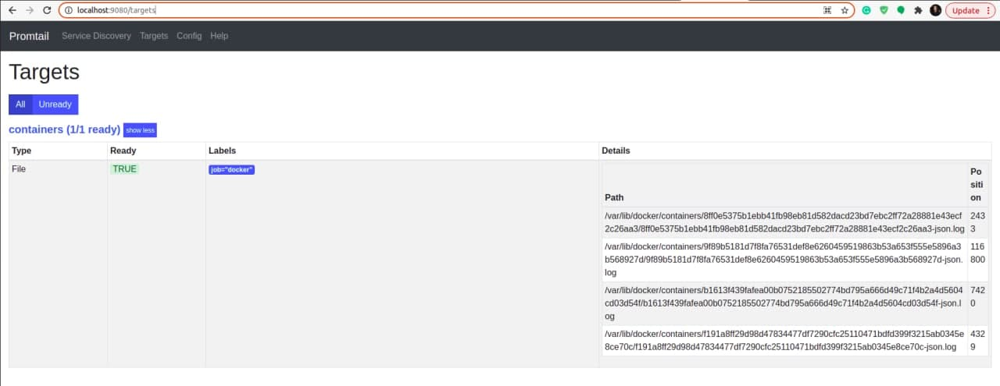

# Logging

## Screenshots of my success
Logs of my app in Grafana:

Available lables in Grafna:

Targets in Promtail:

## Best practices:

### Loki label best practices
1. Static labels are good
2. Use dynamic labels sparingly
3. Label values must always be bounded
4. Be aware of dynamic labels applied by clients
5. Configure caching
6. Logs must be in increasing time order per stream
7. Use chunk_target_size
8. Use -print-config-stderr or -log-config-reverse-order

### Grafana best practices
#### Best practices for creating dashboards
1. When creating a new dashboard, make sure it has a meaningful name
2. If you create many related dashboards, think about how to cross-reference them for easy navigation
3. Grafana retrieves data from a data source. A basic understanding of data sources in general and your specific is important
4. Avoid unnecessary dashboard refreshing to reduce the load on the network or backend
5. Use the left and right Y-axes when displaying time series with different units or ranges
6. Add documentation to dashboards and panels
7. Reuse your dashboards and enforce consistency by using templates and variables
8. Be careful with stacking graph data
#### Best practices for managing dashboards
1. Avoid dashboard sprawl, meaning the uncontrolled growth of dashboards
2. Copying dashboards with no significant changes is not a good idea
3. When you must copy a dashboard, clearly rename it and do not copy the dashboard tags
4. Maintain a dashboard of dashboards or cross-reference dashboards
#### Common observability strategies
1. USE method:
   - **Utilization** - Percent time the resource is busy, such as node CPU usage 
   - **Saturation** - Amount of work a resource has to do, often queue length or node load 
   - **Errors** - Count of error events
2. RED method:
   - **Rate** - Requests per second 
   - **Errors** - Number of requests that are failing 
   - **Duration** - Amount of time these requests take, distribution of latency measurements
3. The Four Golden Signals:
   - **Latency** - Time taken to serve a request
   - **Traffic** - How much demand is placed on your system
   - **Errors** - Rate of requests that are failing
   - **Saturation** - How “full” your system is
#### Dashboard management maturity model
Dashboard management maturity refers to how well-designed and efficient your dashboard ecosystem is

1. Low - default state. At this stage, you have no coherent dashboard management strategy. Almost everyone starts here.
2. Medium - methodical dashboards. At this stage, you are starting to manage your dashboard use with methodical dashboards. You might have laid out a strategy, but there are some things you could improve.
3. High - optimized use. At this stage, you have optimized your dashboard management use with a consistent and thoughtful strategy. It requires maintenance, but the results are worth it.

### Sources I used:
- [Loki label best practices](https://grafana.com/docs/loki/latest/best-practices/)
- [Grafana best practices](https://grafana.com/docs/grafana/latest/best-practices/)
