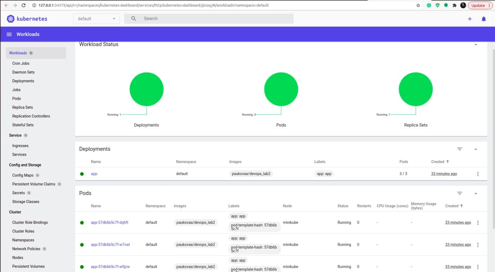
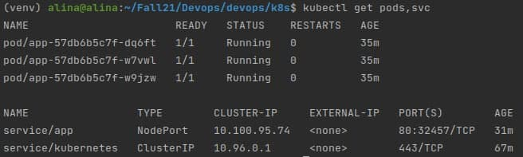

# Kubernetes

1. My application deployed in the minikube without configuration files:

2. My application deployed with configuration files(deployment.yml, service.yml):

# Helm

1. Workloads page in the minikube dashboard:

2. Output of kubectl get pods,svc:

